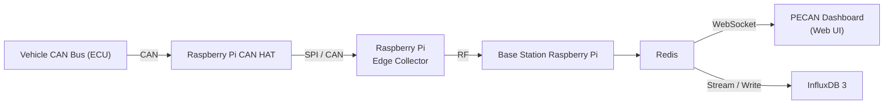

# Project PECAN, and Western Formula Racing's Telemetry System

> A Western Formula Racing Open Source Project

[](https://westernformularacing.org)

Comprehensive telemetry and data acquisition system for real-time monitoring of formula racing vehicle performance. This system captures CAN bus data from the vehicle, transmits it to a base station, and visualizes it through an interactive web dashboard.


## 🏎️ Overview

The repository contains the end-to-end telemetry software for Western Formula Racing vehicles, enabling real-time monitoring of critical vehicle systems during testing and competition. The system consists of:

- **PECAN Dashboard**: Real-time web-based visualization of vehicle telemetry
- **Unified Telemetry Software**: Onboard and base station software for data transmission

## 🏗️ System Architecture



**Data Flow:**

1. Vehicle CAN bus messages are read by Raspberry Pi
2. Onboard Raspberry Pi packs messages in UDP/TCP for radio transmission
3. Base station receives RF data and publishes to Redis
4. Redis-to-WebSocket/InfluxDB bridge broadcasts messages to connected clients and InfluxDB 3
5. PECAN dashboard visualizes data in real-time through customizable views


InfluxDB 3 is implemented in a separate repository:
https://github.com/Western-Formula-Racing/daq-server-components


## 📦 Components

### PECAN Dashboard (`/pecan`)

A modern React + TypeScript web application for real-time telemetry visualization.

**Features:**
- Real-time CAN message visualization with WebSocket connection
- Customizable category-based filtering and color-coding
- Multiple view modes (cards, list, flow diagrams)
- Interactive charts and graphs using Plotly.js
- Built with Vite, React 19, and Tailwind CSS

**Tech Stack:** React 19, TypeScript, Vite, Tailwind CSS, React Bootstrap, Plotly.js

[📖 Detailed Documentation](./pecan/README.md)

### Base Station (`/base-station`)

Python-based receiver system that bridges radio telemetry to WebSocket clients.

**Components:**
- **Redis Message Queue**: Central message broker for telemetry data
- **WebSocket Bridge** (`redis_ws_bridge.py`): Broadcasts Redis messages to connected web clients
- **Docker Deployment**: Containerized setup with Redis included

**Tech Stack:** Python, Redis, WebSockets, Docker

### Car Simulator (`/car-simulate`)

Development and testing tools for simulating vehicle telemetry without physical hardware.

**Features:**
- **CSV Data Playback**: Replay recorded CAN data from CSV files
- **Persistent WebSocket Server**: Continuous data broadcasting for testing
- **WebSocket Sender**: Configurable data transmission scripts

**Includes:**
- Sample CAN data files (CSV format)
- Example DBC (CAN database) file for message definitions
- Docker Compose setup for isolated testing environment

### Host Demo (`/host-demo`)

Production deployment configuration for hosting the PECAN dashboard.

**Features:**
- Dockerized Nginx setup for static file serving
- SSL/HTTPS configuration support
- Domain hosting configuration (`pecan-demo.0001200.xyz`)

[📖 Deployment Guide](./host-demo/README.md)

## 🚀 Quick Start

### Prerequisites

- **Node.js** (v18+) and npm
- **Python** 3.8+
- **Redis** server
- **Docker** and Docker Compose (for containerized deployment)

### Development Setup

1. **Clone the repository:**
   ```bash
   git clone https://github.com/Western-Formula-Racing/daq-radio.git
   cd daq-radio
   ```
   Documentation WIP.

### Manual Setup (Individual Components)

#### PECAN Dashboard
```bash
cd pecan
npm install
npm run dev
```

#### Base Station
```bash
cd base-station
pip install -r requirements.txt
python redis_ws_bridge.py
```

#### Car Simulator
```bash
cd car-simulate
python websocket_sender.py
```

## 📊 CAN Message Categories

PECAN supports configurable message categorization through a simple text-based configuration file. This allows customization of message grouping and color-coding without code changes.

**Configuration:** `pecan/src/assets/categories.txt`

Example categories:
- VCU (Vehicle Control Unit)
- BMS (Battery Management System)
- INV (Inverter)
- TEST MSG

[📖 Category Configuration Guide](./pecan/CATEGORIES.md)

## 🐳 Docker Deployment

### Development Environment
```bash
cd car-simulate/persistent-broadcast
docker-compose up -d
```

### Production Deployment
```bash
cd host-demo
docker-compose up -d --build
```

## 🛠️ Development

### Project Structure
```
daq-radio/
├── pecan/              # React dashboard application
│   ├── src/
│   │   ├── components/ # React components
│   │   ├── pages/      # Page components
│   │   ├── services/   # WebSocket and data services
│   │   └── config/     # Category configuration
│   └── public/         # Static assets
├── base-station/       # Radio receiver and WebSocket bridge
├── car-simulate/       # Testing and simulation tools
├── host-demo/          # Production hosting configuration
└── start_system.sh     # Automated startup script
```

### Technology Stack

- **Frontend**: React 19, TypeScript, Tailwind CSS, React Bootstrap
- **Visualization**: Plotly.js for interactive charts and graphs
- **Build Tools**: Vite
- **Backend**: Python, asyncio, WebSockets
- **Message Broker**: Redis
- **Data Format**: CAN bus (DBC files)
- **Deployment**: Docker, Docker Compose, Nginx

## 🤝 Contributing

Contributions are welcome! This project is maintained by the Western Formula Racing team.

### Development Workflow
1. Fork the repository
2. Create a feature branch
3. Make your changes
4. Test thoroughly with the simulator
5. Submit a pull request

## 📝 License
This project is licensed under the AGPL-3.0 License. See the [LICENSE](./LICENSE) file for details.

## 🔗 Related Resources

- **PECAN Project Page**: [Project PECAN](https://western-formula-racing.github.io/project-pecan-website/)
- **Live Demo**: [Demo](https://western-formula-racing.github.io/daq-radio/dashboard)


## ❓ Support

For questions or issues, please open an issue on GitHub.

---

**Built with ❤️ by Western Formula Racing**

London, Ontario, Canada 🇨🇦 