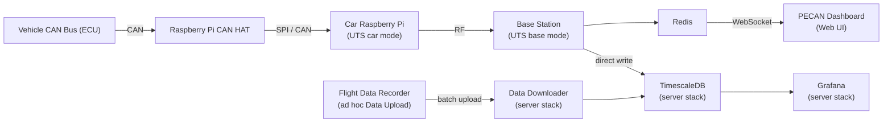

# Project PECAN, and Western Formula Racing's Telemetry System

> A Western Formula Racing Open Source Project

[](https://westernformularacing.org)

Comprehensive telemetry and data acquisition system for real-time monitoring of formula racing vehicle performance. This system captures CAN bus data from the vehicle, transmits it to a base station, and visualizes it through an interactive web dashboard.


## Overview

The repository contains the end-to-end telemetry software for Western Formula Racing vehicles, enabling real-time monitoring of critical vehicle systems during testing and competition. The system consists of:

- **PECAN Dashboard**: Real-time web-based visualization of vehicle telemetry
- **Universal Telemetry Software** (`/universal-telemetry-software`): Onboard and base station software for CAN acquisition, transport, and WebSocket/Redis bridging

## System Architecture



**Data Flow:**

1. Vehicle CAN bus messages are read by the car-side Universal Telemetry Software on the Raspberry Pi
2. The car-side UTS packs messages in UDP/TCP for radio or Ethernet transmission
3. The base-side UTS receives telemetry and publishes it to Redis
4. Redis-to-WebSocket bridge broadcasts messages to connected clients (PECAN dashboard)
5. Base-side TimescaleDB bridge writes decoded CAN frames directly to the server stack's TimescaleDB over the network
6. Grafana visualizes historical data from TimescaleDB; Flight Recorder uploads post-run data via the data downloader API

For the detailed WebSocket message contract between PECAN and UTS, see [`WEBSOCKET_PROTOCOL.md`](./WEBSOCKET_PROTOCOL.md).


## Components

### PECAN Dashboard (`/pecan`)

**Demo:** https://western-formula-racing.github.io/daq-radio/dashboard

A modern React + TypeScript web application for real-time telemetry visualization.

**Features:**

- Real-time CAN message visualization with WebSocket connection
- Customizable category-based filtering and color-coding
- Multiple view modes (cards, list, flow diagrams)
- Interactive charts and graphs using Plotly.js
- Built with Vite, React 19, and Tailwind CSS

**Tech Stack:** React 19, TypeScript, Vite, Tailwind CSS, React Bootstrap, Plotly.js

[📖 Detailed Documentation](./pecan/README.md)

### Universal Telemetry Software (`/universal-telemetry-software`)

Complete DAQ telemetry stack that runs on both the car and base station Raspberry Pis, automatically detecting its role based on CAN bus availability.

**Features:**

- Car/base auto-detection (single codebase deployable to both Pis)
- UDP and TCP telemetry transport with packet recovery
- Redis publisher, WebSocket bridge, and status HTTP server
- Optional TimescaleDB logging (direct write to server TimescaleDB), audio/video streaming, and simulation mode

**Tech Stack:** Python, Redis, WebSockets, Docker, TimescaleDB

[📖 Detailed Documentation](./universal-telemetry-software/README.md)

### Car Simulator (`/car-simulate`)

Development and testing tools for simulating vehicle telemetry without physical hardware.

**Features:**
- **CSV Data Playback**: Replay recorded CAN data from CSV files
- **Persistent WebSocket Server**: Continuous data broadcasting for testing via `car-simulate/persistent-broadcast`
- **WebSocket Sender / container scaffolding**: Minimal Docker setup and example clients for local experiments

**Includes:**
- Sample CAN data files (CSV format)
- Example DBC (CAN database) file for message definitions
- Docker Compose setups for isolated testing environments, including a dev/demo server configuration in `car-simulate/persistent-broadcast`

### CAN Adapter Bridges (`/kvaser-bridge`, `/pecan-bridge`)

GUI adapters for Kvaser and PECAN CAN hardware interfaces. Used during bench testing when physical vehicle hardware is unavailable.

### Flight Recorder (`/flight-recorder`)

Post-run telemetry review and ad hoc WiFi upload PWA. Runs on an ESP32 or RPi on the car — captures CAN frames to IndexedDB during a run, then uploads directly to the server's TimescaleDB over WiFi (no SD card pull required). Deployed on Cloudflare Pages.

**Features:**
- Records CAN frames to IndexedDB during a run
- WiFi upload from car hardware to server TimescaleDB (ESP32 or RPi WiFi)
- Post-run review with the same visualization as Pecan
- Uploads via `POST /api/can-frames/batch` on the data-downloader API

**Live:** https://flight-recorder.pages.dev

### WebSocket Backend (`/ws-backend`)

Convenience deployment for the PECAN WebSocket broadcast server. The dashboard is hosted at `pecan.westernformularacing.org` (GitHub Pages); this backend provides live CAN data over `ws://` or `wss://`.

**Features:**
- Runs the broadcast server with production defaults
- Standard + extended CAN IDs, accumulator simulation
- Optional CSV replay

[📖 Deployment Guide](./ws-backend/README.md)

## Quick Start

### Prerequisites

- **Node.js** (v18+) and npm
- **Python** 3.11+
- **Docker** and Docker Compose (for containerized deployment)
- A cloned copy of this repository

### Base Station (MacBook / Laptop)

The MacBook base station runs the UTS telemetry stack + Pecan dashboard locally, writing directly to the server's TimescaleDB over the network:

```bash
cd universal-telemetry-software/
cp deploy/.env.macbook deploy/.env
# Edit deploy/.env — set REMOTE_IP (car RPi) and TIMESCALE_DSN (server TimescaleDB)
docker compose -f deploy/docker-compose.macbook.yml --profile base up -d
```

Open `http://localhost:3000` for Pecan, `http://localhost:8080` for the status page.

See [`deploy/MACBOOK_DEPLOY.md`](./universal-telemetry-software/deploy/MACBOOK_DEPLOY.md) for full setup details.

### RPi Deployment (Car + Base Station)

Deploy to the car and base station Raspberry Pis:

```bash
cd universal-telemetry-software/
cp deploy/.env.macbook deploy/.env
# Edit deploy/.env with your IPs and credentials
docker compose -f deploy/docker-compose.yml up -d
```

UTS auto-detects its role (car vs base) based on CAN bus availability. See the [UTS README](./universal-telemetry-software/README.md) for hardware setup.

### Server Stack (TimescaleDB + Grafana + APIs)

Deploy the server-side stack on a VPS:

```bash
cd server/installer/
cp .env.example .env
# Edit .env — set passwords and domain
docker compose up -d
```

Services: TimescaleDB (5432), Grafana (8087), data-downloader API, file-uploader, health-monitor.

### Development Setup

1. **Clone the repository:**
   ```bash
   git clone https://github.com/Western-Formula-Racing/data-acquisition.git
   cd data-acquisition
   ```
   Documentation lives in component READMEs such as `pecan/README.md` and `universal-telemetry-software/README.md`.

### Individual Components

#### PECAN Dashboard
```bash
cd pecan
npm install
npm run dev
```

#### Universal Telemetry Software (local dev)
```bash
cd universal-telemetry-software/
cp deploy/.env.macbook deploy/.env
docker compose -f deploy/docker-compose.yml up -d
```

#### Car Simulator
```bash
cd car-simulate/persistent-broadcast
docker compose up -d
```

## CAN Message Categories

PECAN supports configurable message categorization through a simple text-based configuration file. This allows customization of message grouping and color-coding without code changes.

**Configuration:** `pecan/src/assets/categories.txt`

Example categories:
- VCU (Vehicle Control Unit)
- BMS (Battery Management System)
- INV (Inverter)
- TEST MSG

[📖 Category Configuration Guide](./pecan/CATEGORIES.md)

## Docker Deployment

### Simulator / Demo
```bash
cd car-simulate/persistent-broadcast
docker compose up -d
```

### Production Deployment (WebSocket backend)
```bash
cd ws-backend
docker compose up -d --build
```

## Development

### Project Structure
```
data-acquisition/
├── universal-telemetry-software/  # Car/base telemetry stack (UTS) on RPi
│   ├── src/           # Python telemetry source
│   ├── deploy/        # Docker Compose files (prod, staging, macbook, test)
│   └── status/        # Status page HTML
├── pecan/             # React live dashboard (GitHub Pages)
│   └── src/
│       ├── components/ # React components
│       ├── pages/      # Page components
│       └── services/   # WebSocket and data services
├── flight-recorder/   # React data recording PWA
├── car-simulate/      # CAN data simulators (CSV playback, WebSocket broadcast)
├── ws-backend/        # WebSocket broadcast server for PECAN
├── server/            # VPS server stack (TimescaleDB, Grafana, data APIs)
│   └── installer/      # Docker Compose stack for server
│       ├── timescaledb/   # DB init scripts and schema
│       ├── grafana/        # Dashboards and provisioning
│       ├── grafana-bridge/ # Pecan → Grafana API bridge
│       ├── data-downloader/ # FastAPI query builder
│       ├── file-uploader/  # CSV upload web UI
│       ├── health-monitor/ # Container health monitoring
│       ├── sandbox/        # Python execution sandbox
│       └── slackbot/       # Slack bot
├── secret-dbc/        # Git submodule: private DBC files (restricted)
├── kvaser-bridge/     # Kvaser CAN adapter GUI
├── pecan-bridge/      # PECAN CAN adapter
└── grafana-worker/    # Cloudflare Workers proxy for Grafana
```

### Technology Stack

- **Frontend**: React 19, TypeScript, Tailwind CSS, React Bootstrap
- **Visualization**: Plotly.js for interactive charts and graphs
- **Build Tools**: Vite
- **Backend**: Python, asyncio, WebSockets
- **Message Broker**: Redis
- **Time-Series DB**: TimescaleDB (PostgreSQL)
- **Data Format**: CAN bus (DBC files)
- **Deployment**: Docker, Docker Compose, Nginx

## Contributing

Contributions are welcome! This project is maintained by the Western Formula Racing team.

### Development Workflow
1. Fork the repository
2. Create a feature branch
3. Make your changes
4. Test thoroughly with the simulator
5. Submit a pull request

## License
This project is licensed under the AGPL-3.0 License. See the [LICENSE](./LICENSE) file for details.

## Related Resources

- **PECAN Project Page**: [Project PECAN](https://western-formula-racing.github.io/project-pecan-website/)
- **Live Demo**: [Demo](https://western-formula-racing.github.io/daq-radio/dashboard)


## Support

For questions or issues, please open an issue on GitHub.

---

**Built with ❤️ by Western Formula Racing**

London, Ontario, Canada 🇨🇦