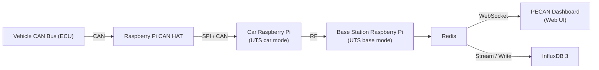

# Project PECAN, and Western Formula Racing's Telemetry System

> A Western Formula Racing Open Source Project

[](https://westernformularacing.org)

Comprehensive telemetry and data acquisition system for real-time monitoring of formula racing vehicle performance. This system captures CAN bus data from the vehicle, transmits it to a base station, and visualizes it through an interactive web dashboard.


## Overview

The repository contains the end-to-end telemetry software for Western Formula Racing vehicles, enabling real-time monitoring of critical vehicle systems during testing and competition. The system consists of:

- **PECAN Dashboard**: Real-time web-based visualization of vehicle telemetry
- **Universal Telemetry Software** (`/universal-telemetry-software`): Onboard and base station software for CAN acquisition, transport, and WebSocket/Redis bridging

## System Architecture



**Data Flow:**

1. Vehicle CAN bus messages are read by the car-side Universal Telemetry Software on the Raspberry Pi
2. The car-side UTS packs messages in UDP/TCP for radio or Ethernet transmission
3. The base-side UTS receives telemetry and publishes it to Redis
4. Redis-to-WebSocket/InfluxDB bridge broadcasts messages to connected clients and InfluxDB 3
5. PECAN dashboard visualizes data in real-time through customizable views

For the detailed WebSocket message contract between PECAN and UTS, see [`WEBSOCKET_PROTOCOL.md`](./WEBSOCKET_PROTOCOL.md).

InfluxDB 3 is implemented in a separate repository:
https://github.com/Western-Formula-Racing/daq-server-components


## Components

### PECAN Dashboard (`/pecan`)

**Demo:** https://western-formula-racing.github.io/daq-radio/dashboard

A modern React + TypeScript web application for real-time telemetry visualization.

**Features:**

- Real-time CAN message visualization with WebSocket connection
- Customizable category-based filtering and color-coding
- Multiple view modes (cards, list, flow diagrams)
- Interactive charts and graphs using Plotly.js
- Built with Vite, React 19, and Tailwind CSS

**Tech Stack:** React 19, TypeScript, Vite, Tailwind CSS, React Bootstrap, Plotly.js

[📖 Detailed Documentation](./pecan/README.md)

### Universal Telemetry Software (`/universal-telemetry-software`)

Complete DAQ telemetry stack that runs on both the car and base station Raspberry Pis, automatically detecting its role based on CAN bus availability.

**Features:**

- Car/base auto-detection (single codebase deployable to both Pis)
- UDP and TCP telemetry transport with packet recovery
- Redis publisher, WebSocket bridge, and status HTTP server
- Optional InfluxDB 3 logging, audio/video streaming, and simulation mode

**Tech Stack:** Python, Redis, WebSockets, Docker, InfluxDB 3

[📖 Detailed Documentation](./universal-telemetry-software/README.md)

### Car Simulator (`/car-simulate`)

Development and testing tools for simulating vehicle telemetry without physical hardware.

**Features:**
- **CSV Data Playback**: Replay recorded CAN data from CSV files
- **Persistent WebSocket Server**: Continuous data broadcasting for testing via `car-simulate/persistent-broadcast`
- **WebSocket Sender / container scaffolding**: Minimal Docker setup and example clients for local experiments

**Includes:**
- Sample CAN data files (CSV format)
- Example DBC (CAN database) file for message definitions
- Docker Compose setups for isolated testing environments, including a dev/demo server configuration in `car-simulate/persistent-broadcast`

### WebSocket Backend (`/ws-backend`)

Convenience deployment for the PECAN WebSocket broadcast server. The dashboard is hosted at `pecan.westernformularacing.org` (GitHub Pages); this backend provides live CAN data over `ws://` or `wss://`.

**Features:**
- Runs the broadcast server with production defaults
- Standard + extended CAN IDs, accumulator simulation
- Optional CSV replay

[📖 Deployment Guide](./ws-backend/README.md)

## Quick Start

### Prerequisites

- **Node.js** (v18+) and npm
- **Python** 3.11+
- **Redis** server (bundled via Docker Compose in `universal-telemetry-software` for most deployments)
- **Docker** and Docker Compose (for containerized deployment)

### Development Setup

1. **Clone the repository:**
   ```bash
   git clone https://github.com/Western-Formula-Racing/daq-radio.git
   cd daq-radio
   ```
   Documentation lives in component READMEs such as `pecan/README.md` and `universal-telemetry-software/README.md`.

### Manual Setup (Individual Components)

#### PECAN Dashboard
```bash
cd pecan
npm install
npm run dev
```

#### Universal Telemetry Software
```bash
cd universal-telemetry-software
docker compose up -d
# See universal-telemetry-software/README.md for full hardware and production setup details.
```

#### Car Simulator
```bash
cd car-simulate/persistent-broadcast
docker compose up -d
```

## CAN Message Categories

PECAN supports configurable message categorization through a simple text-based configuration file. This allows customization of message grouping and color-coding without code changes.

**Configuration:** `pecan/src/assets/categories.txt`

Example categories:
- VCU (Vehicle Control Unit)
- BMS (Battery Management System)
- INV (Inverter)
- TEST MSG

[📖 Category Configuration Guide](./pecan/CATEGORIES.md)

## Docker Deployment

### Simulator / Demo
```bash
cd car-simulate/persistent-broadcast
docker compose up -d
```

### Production Deployment (WebSocket backend)
```bash
cd ws-backend
docker compose up -d --build
```

## Development

### Project Structure
```
daq-radio/
├── pecan/              # React dashboard application
│   ├── src/
│   │   ├── components/ # React components
│   │   ├── pages/      # Page components
│   │   ├── services/   # WebSocket and data services
│   │   └── config/     # Category configuration
│   └── public/         # Static assets
├── universal-telemetry-software/  # Car/base telemetry stack (UTS)
├── flight-recorder/    # React app for post-run data review and upload
├── car-simulate/       # Testing and simulation tools
├── ws-backend/         # WebSocket broadcast server deployment
├── dev-utils/          # Developer utilities and scripts
```

### Technology Stack

- **Frontend**: React 19, TypeScript, Tailwind CSS, React Bootstrap
- **Visualization**: Plotly.js for interactive charts and graphs
- **Build Tools**: Vite
- **Backend**: Python, asyncio, WebSockets
- **Message Broker**: Redis
- **Data Format**: CAN bus (DBC files)
- **Deployment**: Docker, Docker Compose, Nginx

## Contributing

Contributions are welcome! This project is maintained by the Western Formula Racing team.

### Development Workflow
1. Fork the repository
2. Create a feature branch
3. Make your changes
4. Test thoroughly with the simulator
5. Submit a pull request

## License
This project is licensed under the AGPL-3.0 License. See the [LICENSE](./LICENSE) file for details.

## Related Resources

- **PECAN Project Page**: [Project PECAN](https://western-formula-racing.github.io/project-pecan-website/)
- **Live Demo**: [Demo](https://western-formula-racing.github.io/daq-radio/dashboard)


## Support

For questions or issues, please open an issue on GitHub.

---

**Built with ❤️ by Western Formula Racing**

London, Ontario, Canada 🇨🇦