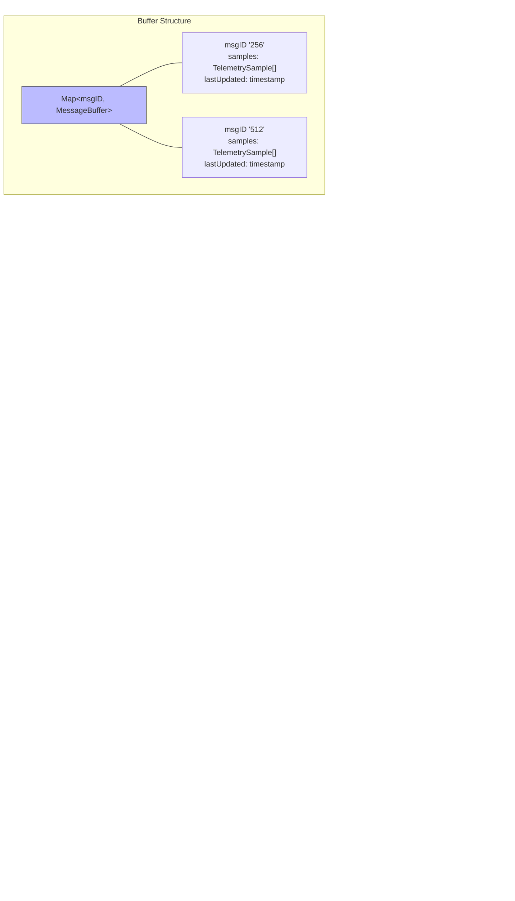
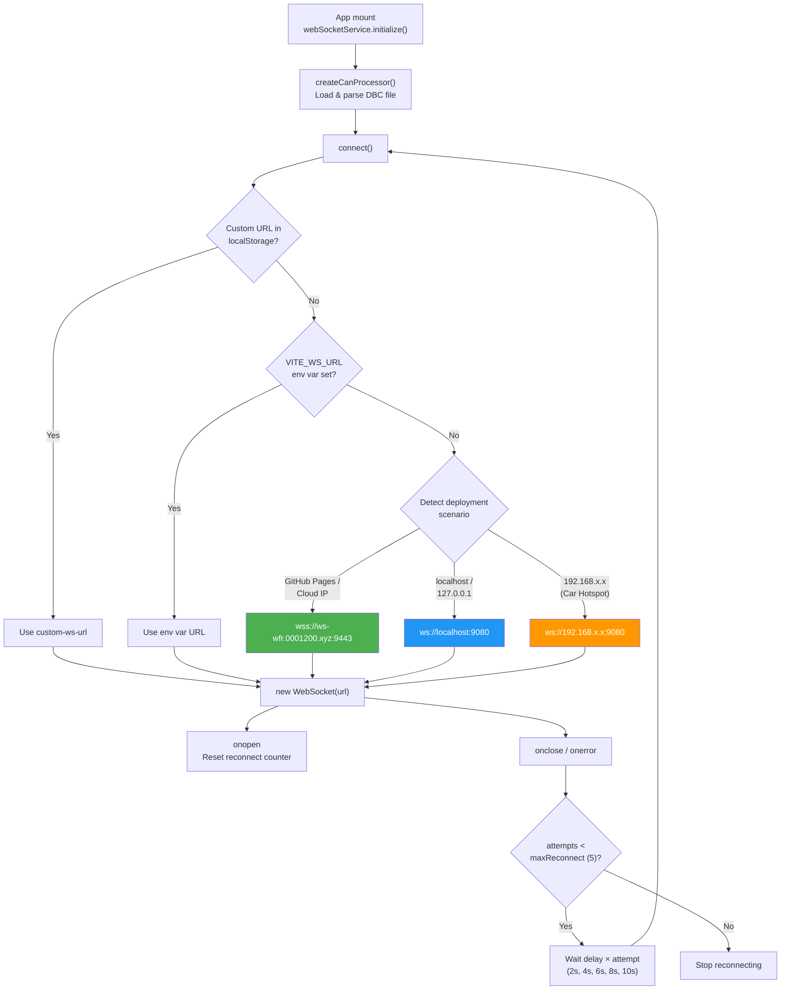

# PECAN Live Dashboard


Real-time CAN bus telemetry visualization dashboard for Western Formula Racing vehicles.


Focused Accumulator Monitor for charge cart display.

 

Drag-and-drop signal monitoring canvas.


## Features

- **Real-time WebSocket telemetry** - Live CAN message decoding and visualization
- **DBC file parsing** - Automatic signal extraction using `candied` library
- **Multiple view modes** - Cards, list, and flow diagram visualizations
- **Interactive charts** - Plotly.js-powered data visualization
- **Customizable categories** - Organize messages by system (VCU, BMS, INV, etc.)

## Architecture

### System Overview

```mermaid
graph LR
    subgraph Car ["Car (Raspberry Pi)"]
        CAN["CAN Bus<br/>(can0)"]
        CarUTS["data.py<br/>(car mode)"]
        CAN <--> CarUTS
    end

    subgraph Host ["Host (Raspberry Pi / Server)"]
        BaseUTS["data.py<br/>(base mode)"]
        Redis[("Redis")]
        WSBridge["websocket_bridge.py<br/>(:9080 / :9443)"]
        BaseUTS -->|"PUBLISH<br/>can_messages"| Redis
        Redis -->|"SUBSCRIBE<br/>can_messages"| WSBridge
    end

    subgraph Pecan ["Pecan Dashboard (Browser)"]
        WS["WebSocketService"]
        CP["CAN Processor<br/>(candied + DBC)"]
        DS["DataStore<br/>(Ring Buffer)"]
        RH["React Hooks<br/>(useDataStore)"]
        UI["UI Components<br/>(Dashboard, Plots,<br/>Accumulator, Monitor)"]
    end

    CarUTS -->|"UDP :5005<br/>batched CAN"| BaseUTS
    WSBridge <-->|"WebSocket"| WS
    WS -->|raw JSON| CP
    CP -->|DecodedMessage| DS
    DS -->|pub/sub notify| RH
    RH -->|reactive state| UI
```



### Data Buffering Pipeline

The `DataStore` is a singleton in-browser ring buffer that serves as the single source of truth for live telemetry. Each CAN message ID gets its own sample array, pruned on every ingest.



**Key buffering details:**
- **Retention window**: 5 minutes (300,000 ms) — configurable via `setRetentionWindow()`
- **Pruning strategy**: On every `ingestMessage()`, samples older than the cutoff are filtered out
- **Timestamp correction**: Timestamps older than 1 hour are replaced with `Date.now()` (handles recorded/replayed/ECU relative timestamp data)
- **Per-message isolation**: Each CAN ID has its own independent sample array
- **Memory estimate**: ~200 bytes per sample, tracked via `getStats()`

### WebSocket Connection Method



**Connection features:**
- **Auto-protocol detection**: `ws://` on HTTP, `wss://` on HTTPS
- **Three deployment modes**: Production cloud, localhost dev, car hotspot (192.168.x.x)
- **Configurable override**: Users can set a custom WebSocket URL via Settings
- **Reconnection**: Up to 5 attempts with linear backoff (2s increments)
- **Bidirectional**: Supports downlink (telemetry) and uplink (`can_send`, `can_send_batch`, `ping`)

## Development

### Prerequisites

- Node.js 18+
- npm

### Setup

```bash
npm install
npm run dev
```

The development server will start on `http://localhost:5173` with a WebSocket server on `ws://localhost:9080`.

### Testing

This project uses **Vitest** for comprehensive unit and integration testing of CAN bus parsing logic.

```bash
# Run tests in watch mode
npm test

# Run tests once (CI mode)
npm run test:ci

# Run tests with coverage report
npm run test:coverage

# Run tests with UI
npm run test:ui
```

#### Test Coverage

The test suite includes **42 tests** covering:

- ✅ CAN log line parsing (CSV format)
- ✅ CAN message decoding with DBC files
- ✅ Physical value parsing (units extraction)
- ✅ WebSocket message format handling (string, object, array)
- ✅ Batch message processing
- ✅ DBC file loading and caching
- ✅ Error handling for invalid messages

**Critical components tested:**
- `parseCanLogLine()` - CSV to CAN message conversion
- `decodeCanMessage()` - DBC-based signal extraction
- `parsePhysValue()` - Unit parsing from Candied output
- `createCanProcessor()` - Full processing pipeline
- WebSocket message handlers - Multiple format support

### Building

```bash
npm run build
```

Production build outputs to `./dist`.

## CI/CD

GitHub Actions automatically:
1. **Runs all tests** on every push to `main`
2. **Builds the application** if tests pass
3. **Deploys to GitHub Pages** for the live demo

Tests must pass before deployment proceeds, ensuring CAN parsing reliability.

## Tech Stack

- **React 19** + **TypeScript** - UI framework
- **Vite** - Build tool and dev server
- **Tailwind CSS v4** - Styling
- **candied v2.2.0** - DBC file parsing and CAN message decoding
- **Plotly.js** - Interactive charts
- **Vitest** - Testing framework
- **WebSockets** - Real-time data streaming

## Project Structure

```
pecan/
├── src/
│   ├── components/     # React components
│   ├── pages/          # Page components
│   ├── services/       # WebSocket service
│   ├── utils/          # CAN processing utilities
│   │   ├── canProcessor.ts      # Main CAN parsing logic
│   │   ├── canProcessor.test.ts # Unit tests
│   │   └── parsePhysValue.test.ts # Helper tests
│   ├── assets/         # DBC files and static assets
│   └── lib/            # Data store
├── public/             # Static files
└── dist/               # Build output
```

## License

AGPL-3.0 - See LICENSE file for details.
