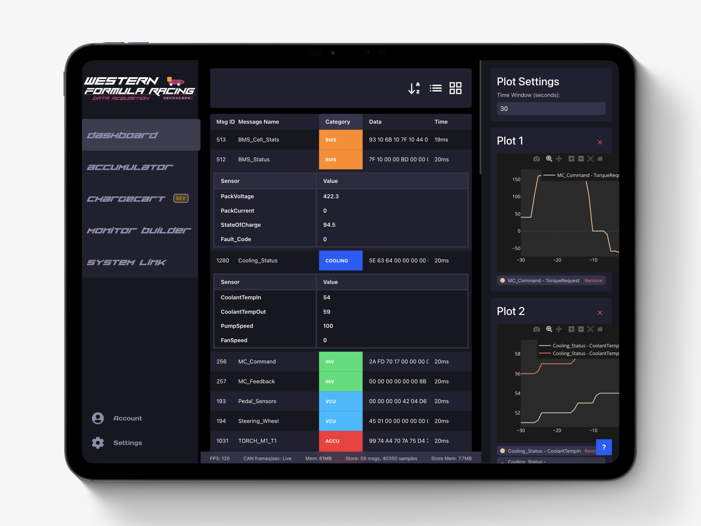
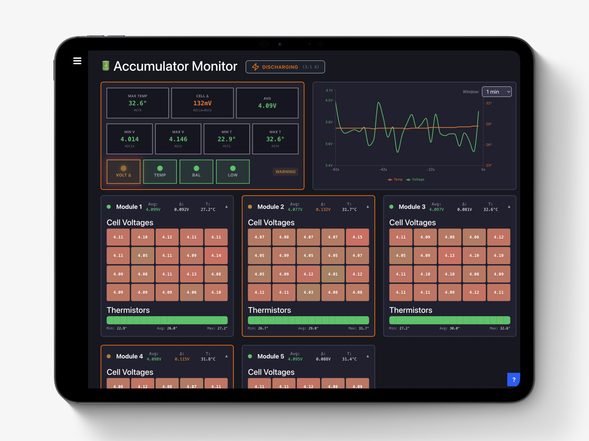
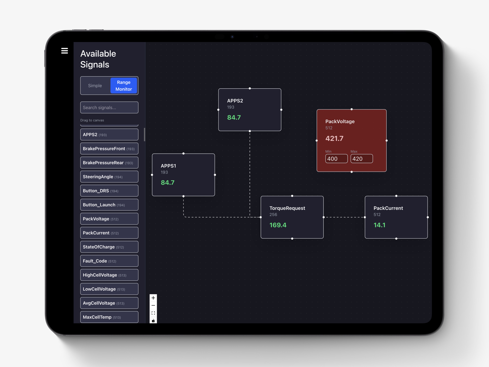
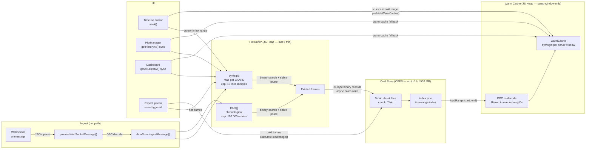
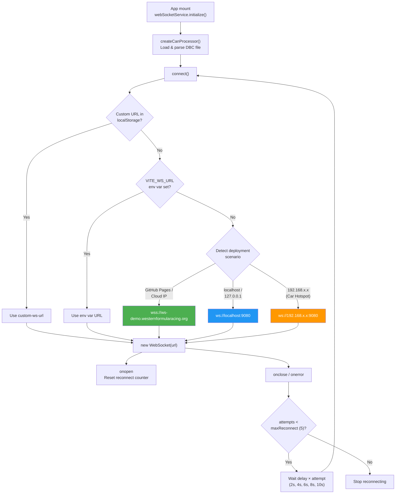

# PECAN Live Dashboard



Real-time CAN bus telemetry visualization dashboard for Western Formula Racing vehicles.



Focused Accumulator Monitor for charge cart display.

 

Drag-and-drop signal monitoring canvas.


## Features

- **Real-time WebSocket telemetry** - Live CAN message decoding and visualization
- **DBC file parsing** - Automatic signal extraction using `candied` library
- **Multiple view modes** - Cards, list, and flow diagram visualizations
- **Interactive charts** - Plotly.js-powered data visualization
- **Customizable categories** - Organize messages by system (VCU, BMS, INV, etc.)

## Architecture

### System Overview

```mermaid
graph LR
    subgraph Car ["Car (Raspberry Pi)"]
        CAN["CAN Bus<br/>(can0)"]
        CarUTS["data.py<br/>(car mode)"]
        CAN <--> CarUTS
    end

    subgraph Host ["Host (Raspberry Pi / Server)"]
        BaseUTS["data.py<br/>(base mode)"]
        Redis[("Redis")]
        WSBridge["websocket_bridge.py<br/>(:9080 / :9443)"]
        BaseUTS -->|"PUBLISH<br/>can_messages"| Redis
        Redis -->|"SUBSCRIBE<br/>can_messages"| WSBridge
    end

    subgraph Pecan ["Pecan Dashboard (Browser)"]
        WS["WebSocketService"]
        CP["CAN Processor<br/>(candied + DBC)"]
        DS["DataStore<br/>(Hot Buffer + OPFS Cold)"]
        RH["React Hooks<br/>(useDataStore)"]
        UI["UI Components<br/>(Dashboard, Plots,<br/>Accumulator, Monitor)"]
    end

    CarUTS -->|"UDP :5005<br/>batched CAN"| BaseUTS
    WSBridge <-->|"WebSocket"| WS
    WS -->|raw JSON| CP
    CP -->|DecodedMessage| DS
    DS -->|pub/sub notify| RH
    RH -->|reactive state| UI
```



### Hot / Cold Data Pipeline

PECAN uses a three-tier memory architecture so the JS heap stays bounded even on a Raspberry Pi during a multi-hour session.



**Key design decisions:**

- **Hot buffer** holds the last **5 minutes** of decoded `TelemetrySample` objects per CAN ID (`byMsgId`, capped at 10 000 samples per message) plus a flat chronological `trace[]` (capped at 100 000 entries).  All pruning uses **binary search + in-place splice** — no `.filter()` array allocation.
- **Cold store** (OPFS, `ColdStore.ts`): evicted frames are converted to 21-byte binary records and written to time-partitioned 5-minute chunk files on the Origin Private File System. Total cap: 1 hour / 500 MB. Oldest chunks are dropped when the limit is reached and a warning banner appears.
- **Warm cache**: when the timeline cursor scrubs into cold territory, `prefetchWarmCache(start, end)` reads the relevant OPFS chunks, re-decodes them via the DBC, and populates a temporary `byMsgId` map. All sync read APIs (`getHistoryAt`, `getAllLatestAt`, `getHistory`) transparently merge hot + warm data.
- **Export** is the only explicit user action that persists data. Clicking "Export .pecan" reads both the hot trace and cold store for the selected range — no "start recording" step required.

**Memory budget on RPi (typical 56-message CAN bus at ~50 Hz):**

| Layer | Max samples | Approx heap |
|---|---|---|
| `byMsgId` (hot) | 56 × 10 000 = 560 k | ~336 MB (600 B/sample) |
| `trace[]` (hot) | 100 000 | shared refs, ~0 extra |
| Warm cache | ~1 plot window | ~10–50 MB |
| OPFS cold store | up to 1 h on disk | off-heap |

### WebSocket Connection Method



**Connection features:**
- **Auto-protocol detection**: `ws://` on HTTP, `wss://` on HTTPS
- **Deployment modes**: Production cloud, localhost dev, car hotspot (192.168.x.x)
- **Default backend**: On non-`192.x.x.x` hosts (including `localhost`) PECAN connects to the hosted backend at `wss://ws-demo.westernformularacing.org`, unless overridden
- **Configurable override**: Users can set a custom WebSocket URL via Settings or `VITE_WS_URL`
- **Reconnection**: Up to 5 attempts with linear backoff (2s increments)
- **Uplink in active development**: The WebSocket protocol supports uplink (`can_send`, `can_send_batch`, `ping`), but the PECAN UI and client helpers for sending control messages are still under active development

## Development

### Prerequisites

- Node.js 18+
- npm

### Setup

```bash
npm install
npm run dev
```

By default, the development server runs on `http://localhost:5173` and PECAN connects to the **hosted** telemetry backend at `wss://ws-demo.westernformularacing.org:9443`. To force a different backend (for example, a local UTS instance on `ws://localhost:9080`), set `VITE_WS_URL` or configure a `custom-ws-url` in the PECAN Settings dialog.

### Testing

This project uses **Vitest** for comprehensive unit and integration testing of CAN bus parsing logic.

```bash
# Run tests in watch mode
npm test

# Run tests once (CI mode)
npm run test:ci

# Run tests with coverage report
npm run test:coverage

# Run tests with UI
npm run test:ui
```

#### Test Coverage

The test suite includes **42 tests** covering:

- ✅ CAN log line parsing (CSV format)
- ✅ CAN message decoding with DBC files
- ✅ Physical value parsing (units extraction)
- ✅ WebSocket message format handling (string, object, array)
- ✅ Batch message processing
- ✅ DBC file loading and caching
- ✅ Error handling for invalid messages

**Critical components tested:**
- `parseCanLogLine()` - CSV to CAN message conversion
- `decodeCanMessage()` - DBC-based signal extraction
- `parsePhysValue()` - Unit parsing from Candied output
- `createCanProcessor()` - Full processing pipeline
- WebSocket message handlers - Multiple format support

### Building

```bash
npm run build
```

Production build outputs to `./dist`.

## CI/CD

GitHub Actions automatically:
1. **Runs all tests** on every push to `main`
2. **Builds the application** if tests pass
3. **Deploys to GitHub Pages** for the live demo

Tests must pass before deployment proceeds, ensuring CAN parsing reliability.

## Tech Stack

- **React 19** + **TypeScript** - UI framework
- **Vite** - Build tool and dev server
- **Tailwind CSS v4** - Styling
- **candied v2.2.0** - DBC file parsing and CAN message decoding
- **Plotly.js** - Interactive charts
- **Vitest** - Testing framework
- **WebSockets** - Real-time data streaming

## Project Structure

```
pecan/
├── src/
│   ├── components/     # React components
│   ├── pages/          # Page components
│   ├── services/       # WebSocket service
│   ├── utils/          # CAN processing utilities
│   │   ├── canProcessor.ts      # Main CAN parsing logic
│   │   ├── canProcessor.test.ts # Unit tests
│   │   └── parsePhysValue.test.ts # Helper tests
│   ├── assets/         # DBC files and static assets
│   └── lib/            # Data store
├── public/             # Static files
└── dist/               # Build output
```

## License

AGPL-3.0 - See LICENSE file for details.
