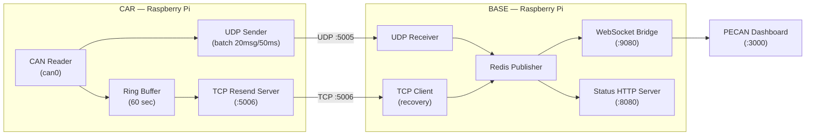

# Universal Telemetry Software

Complete DAQ telemetry system for Formula Racing vehicles. Runs on both the car and base station Raspberry Pis, automatically detecting its role based on CAN bus availability.

---

## Architecture



**Car mode** is auto-detected when `can0` is present. Otherwise the software runs in **base station mode**.

---

## Hardware Setup (Ubuntu)

This section covers setting up a CAN HAT (e.g. MCP2515-based) on Ubuntu before running the software.

### 1. Enable the CAN HAT kernel module

Install the SocketCAN tools:
```bash
sudo apt update && sudo apt install -y can-utils
```

Load the CAN modules at boot:
```bash
echo "can" | sudo tee -a /etc/modules
echo "can_raw" | sudo tee -a /etc/modules
echo "mcp251xfd" | sudo tee -a /etc/modules
```

### 2. Configure the HAT overlay

Edit `/boot/firmware/config.txt` (Ubuntu on RPi uses `/boot/firmware/`, not `/boot/`):
```ini
dtoverlay=mcp251xfd,oscillator=20000000,interrupt=25
dtoverlay=spi-bcm2835
```

> Our HAT uses the **MCP2517FD** CAN FD controller with a **20 MHz** crystal (S73305 20.000X15R) and MCP2562FDT-HSN transceiver. The interrupt GPIO (25) may need to be adjusted depending on how your HAT is wired — check the HAT schematic.

Reboot after editing:
```bash
sudo reboot
```

### 3. Bring up can0 automatically on boot

Create a systemd service to bring up the interface on boot:
```bash
sudo nano /etc/systemd/system/can0.service
```

Paste:
```ini
[Unit]
Description=CAN bus interface can0
After=network.target

[Service]
Type=oneshot
ExecStart=/sbin/ip link set can0 up type can bitrate 500000
RemainAfterExit=yes

[Install]
WantedBy=multi-user.target
```

Enable and start:
```bash
sudo systemctl enable can0
sudo systemctl start can0
```

### 4. Verify CAN is working

Check the interface is up:
```bash
ip link show can0
# Should show: can0: <NOARP,UP,LOWER_UP> ...
```

Listen for CAN frames (requires a live CAN bus):
```bash
candump can0
```

Send a test frame on a loopback setup:
```bash
sudo ip link set can0 type can loopback on
cansend can0 123#DEADBEEF
candump can0
```

Once `can0` is confirmed working, proceed to deployment.

---

## Quick Start

### Prerequisites
- Raspberry Pi 4/5 with Ubuntu
- Docker and Docker Compose installed
- CAN HAT set up (see Hardware Setup above)
- Network connection between car and base (LAN cable or Ubiquiti radios)

> ```
>
> Then use the rpi5 override whenever starting the stack:
> ```bash
> docker compose -f deploy/docker-compose.prod.yml -f deploy/docker-compose.rpi5.yml up -d
> ```

### Installation

Clone the repository:
```bash
git clone https://github.com/Western-Formula-Racing/daq-radio.git
cd daq-radio/universal-telemetry-software
```

Set `REMOTE_IP` in `deploy/docker-compose.yml` to the IP of the other RPi:
```yaml
environment:
  - REMOTE_IP=192.168.1.20   # car sets this to base IP, base sets this to car IP
```

Start services:
```bash
docker compose up -d
```

### Verify

Check logs:
```bash
docker compose logs -f telemetry
# Car should show:  "Auto-detected Role: car"
# Base should show: "Auto-detected Role: base"
```

### Access

| Interface | URL |
|-----------|-----|
| Status page | `http://<ip>:8080` |
| PECAN dashboard | `http://<ip>:3000` |
| WebSocket | `ws://<ip>:9080` |

---

## Deploying with Pre-built Images (GHCR)

Instead of building locally, use pre-built images from GitHub Container Registry:

```bash
# Login (required for private packages)
echo $CR_PAT | docker login ghcr.io -u YOUR_GITHUB_USERNAME --password-stdin

# Pull and start
docker compose -f deploy/docker-compose.prod.yml pull
docker compose -f deploy/docker-compose.prod.yml up -d
```

Images are built for both `linux/amd64` and `linux/arm64` (Raspberry Pi).

---

## Configuration

### Environment Variables

| Variable | Default | Description |
|----------|---------|-------------|
| `ROLE` | `auto` | Force `car` or `base` (auto-detects from `can0`) |
| `REMOTE_IP` | `192.168.1.100` | IP of the other RPi |
| `UDP_PORT` | `5005` | Real-time UDP streaming port |
| `TCP_PORT` | `5006` | TCP retransmission port |
| `REDIS_URL` | `redis://localhost:6379/0` | Redis connection |
| `WS_PORT` | `9080` | WebSocket port for PECAN |
| `STATUS_PORT` | `8080` | HTTP port for status page |
| `SIMULATE` | `false` | Simulate CAN data (no hardware needed) |
| `ENABLE_VIDEO` | `false` | Enable video streaming |
| `ENABLE_AUDIO` | `false` | Enable audio streaming |
| `ENABLE_TIMESCALE_LOGGING` | `false` | Log telemetry to server TimescaleDB (direct write) |

### Ports

| Port | Protocol | Purpose |
|------|----------|---------|
| 5005 | UDP | CAN data streaming |
| 5006 | TCP | Packet retransmission |
| 6379 | TCP | Redis (internal) |
| 8080 | HTTP | Status monitoring page |
| 9080 | WebSocket | PECAN dashboard feed |
| 3000 | HTTP | PECAN dashboard UI |

---

## Monitoring

**Status page** (`http://<ip>:8080`): real-time connection status, packet stats, live packet rate chart.

**PECAN dashboard** (`http://<ip>:3000`): live CAN message visualization. Connects automatically to WebSocket on port 9080.

---

## Redis Channels

### `can_messages`
Published by base station, consumed by PECAN.
```json
[{ "time": 1234567890, "canId": 256, "data": [146, 86, 42, 123, 205, 255, 0, 0] }]
```

### `system_stats`
Published by base station every second.
```json
{ "received": 45, "missing": 1, "recovered": 0 }
```

---

## Troubleshooting

**No data flowing**
```bash
docker compose ps                                      # check containers running
docker compose logs telemetry | grep "UDP"             # car: confirm sending
docker compose logs telemetry | grep "Initial sequence" # base: confirm receiving
ping <other-rpi-ip>                                    # confirm network
```

**WebSocket not connecting**
```bash
docker compose logs telemetry | grep "WebSocket"
# Expected: "WebSocket server running at ws://0.0.0.0:9080"
```

**can0 not detected**
```bash
ip link show can0       # check interface exists
dmesg | grep mcp        # check for kernel errors loading the HAT driver
systemctl status can0   # check the bring-up service
```

---

## File Structure

```
universal-telemetry-software/
├── main.py                     # Main orchestrator
├── src/
│   ├── data.py                 # UDP/TCP + Redis (car & base)
│   ├── audio.py                # Audio streaming
│   ├── video.py                # Video streaming
│   ├── websocket_bridge.py     # Redis -> WebSocket for PECAN
│   ├── timescale_bridge.py     # TimescaleDB logging (Redis → server TimescaleDB)
│   ├── leds.py                 # LED status indicators
│   ├── link_diagnostics.py     # Radio link health
│   └── poe.py                  # PoE monitor
├── tests/
├── deploy/
│   ├── docker-compose.yml          # Development/local build
│   ├── docker-compose.prod.yml     # Production (GHCR images)
│   ├── docker-compose.staging.yml  # Staging (:test-latest images)
│   ├── docker-compose.test.yml     # Integration test stack (CI)
│   ├── docker-compose.can-test.yml # vCAN pipeline tests
│   ├── docker-compose.jitsi.yml    # Optional Jitsi comms addon
│   ├── docker-compose.rpi5.yml     # RPi5 QEMU override
│   └── WHICH_ONE.md                # Compose file reference
├── Dockerfile
└── requirements.txt
```

---

Built by Western Formula Racing — London, Ontario, Canada